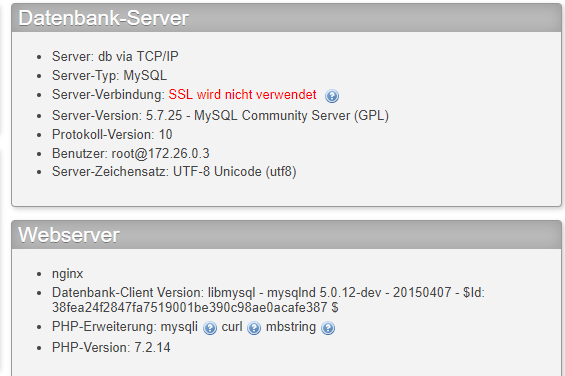
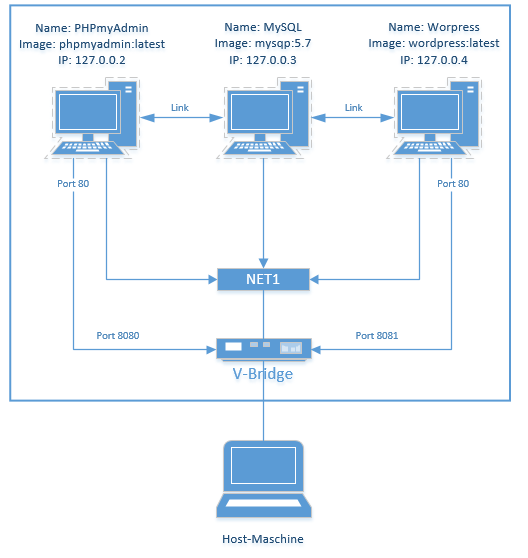
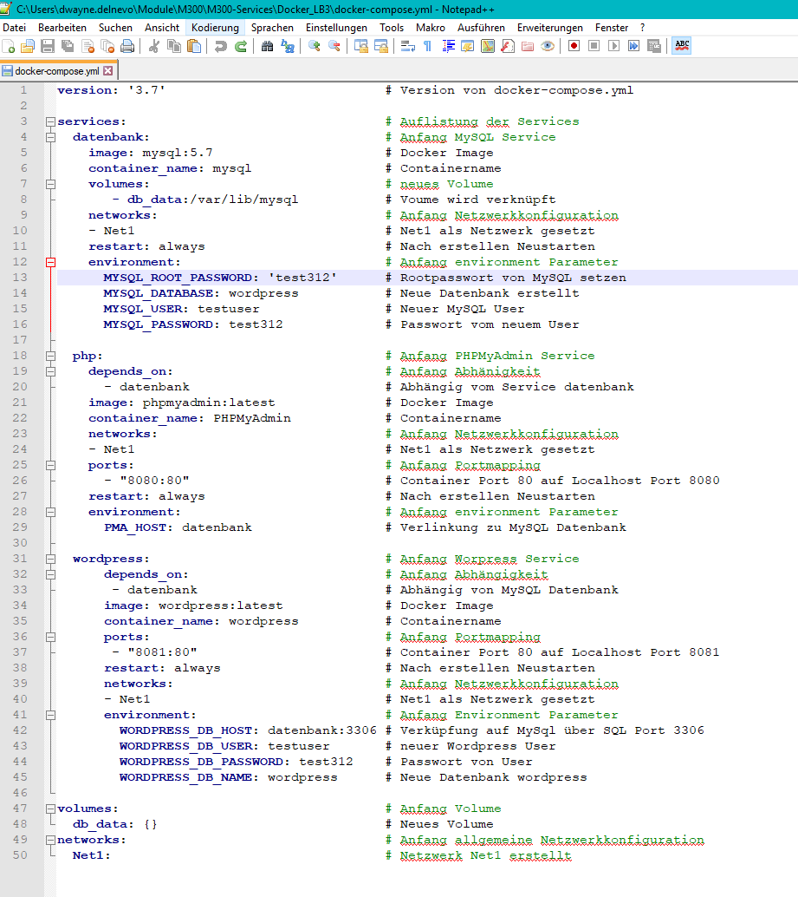
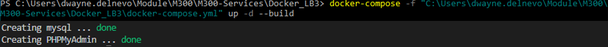
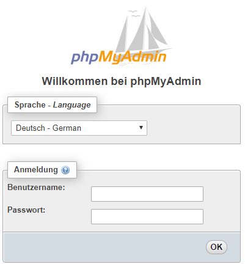
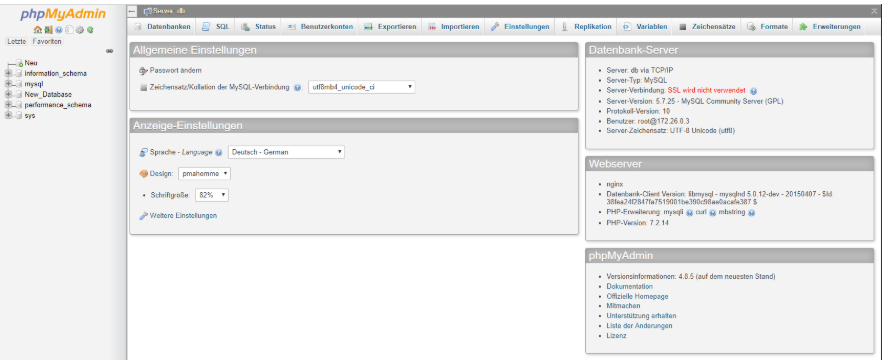

***
# Dokumentation LB3 Docker
**Zum Modul 300 von Dwayne Delnevo**
***
## Inhaltsverzeichnis
- [Einleitung](#einleitung)
- [Der Service](#der-service)
- [Technische Angaben](#technische-angaben)
  - [Netzwerkplan](#netzwerkplan)
  - [Code](#code)
  - [Befehle](#befehle)
  - [Anleitung für den Betrieb](#anleitung-f%C3%BCr-den-betrieb)
- [Testing](#kapitel-3-testing)
- [Vergleich Vorwissen und Wissenzuwachs](#vergleich)
- [Reflexion zur LB3](#reflexion-zur-lb3)

  

***
# Einleitung

Visual Studio Code, Git-Client, Markdown-Editor und SSH-Keys gleich wie in LB2.  
In dieser LB geht es darum, einen Service mit Docker aufzusetzten und zu betreiben. Docker ist eine Containervirtualisierungsplatform; Open-Source. Mit Hilfe des Docker Hubs können sehr leicht viele Images (Vorbereitete Zustände von Anwendungen oder OS) heruntergeladen werden.  

| Kategorie              | Produkt                                              |
| ------------------     | ---------------------------------------------------- |
| Versionsverwaltung     | [Git](https://git-scm.com/)                          |
| Container Engine       | [Docker for Windows](https://www.docker.com/)        |
| Editor                 | [Visual Studio Code](https://code.visualstudio.com/) |

# Der Service

Ich werde **Wordpress** als Service verwenden; im Hintergrund realisiere ich **mysql**.  
Dank **PHPmyAdmin** kann man die Datenbank sehr leicht mit dem Webinterface administrieren. 

Durch die Verlinkung von **MySQL** -> **PHPmyAdmin** und **MySQL** -> **Wordpress** wird dies möglich gemacht.



# Technische Angaben

Der Service wird mit 3 Docker Container realisiert. Bei ersten wird MySQL, beim zweiten PHPMyAdmin und beim dritte Wordpress installiert. Durch das custom "Net1" Netzwerk können die Container kommunizieren.

| **Info**           | **Container** 1 |   **Container** 2 |  **Container** 3 |
| :----------------- | :-------------: | ----------------: | ---------------: |
| **Container Name** |      MySQL      |    PHPMyAdmin     |     Wordpress    |
| **Docker Image**   |    MySQL 5.7    |    PHPmyAdmin     |     Wordpress    |
| **Netzwerk**       |      Net1       |        Net1       |        Net1      |
| **IP**             |      DHCP       |        DHCP       |        DHCP      |

## Netzwerkplan

  
Das mit Blau markierte Netzwerk ist das Dockernetzwerk welches sich im 127.0.0.x/24 Bereich befindet.

Durch das Konfigurieren des Net1 auf "Bridge", werden die Container vom Host erreichbar sein; unter anderem ist der Host dann auch der Gateway ins WAN.  

Per DHCP bekommen die, an das Net1 angehängten, Container eine IP im Range 127.0.0.x/24. Der Gateway/Host hat immer die IP 127.0.0.1.  

Im Abschnitt **Code** wird definiert, wie **PHPmyAdmin** und **Wordpress** auf den **MySQL** Container zugreifen.  

Damit ich vom Host aus auf das Webinterface des **PHPmyAdmin** Zugriff habe, muss der Port 80 des Containers auf den Host Port 8080 gemapt werden. Bei **Wordpress** ähnlich; auf 8081.  

## Code
Das Projekt wurde mit Hilfe eines Docker Compose Files erstellt. Alle Netzwerk und Container Parameter werden dabei definiert.  
Mit folgendem Befehl wird die ganze Struktur aufgesetzt:  
```Shell
docker-compose -f ʺPfad\zum\File\docker-compose.ymlʺ up -d --build
 ```
Durch "-d" wird definiert, dass die Container im Hintergrund aufgesetzt wird.

Durch "-f" setzt man den Pfad zum docker-compose.yml File

Hier der Code des Docker Compose Files:



**Auf Zeile 4-16** wird der MySQL Container erstellt und konfiguriert

**Auf Zeile 18-29** wird der PHPMyAdmin Container erstellt. Dabei wird auf Zeile 29 die Verlinkung zwischen PHPMyAdmin und MySQL realisiert(Datenbank = MySQL Container).

**Auf Zeile 32-46** wird der Wordpress COntainer erstellt. Auf Zeile 42 wird die Verlinkung zu MySQL gesetzt.

**Auf Zeile 47-48** wird das Volume gesetzt.

**Auf der Zeile 49-50** wird das Netzwerk erstellt

Das File ist in meinem Repository abgelegt.  

## Befehle  

**Docker**  

| Befehl         | Beschreibung                                    |
| -------------- | ----------------------------------------------- |
| `docker run`   | Führt einen Befehl in einem neuen Container aus |
| `docker start` | Startet einen oder mehrere Container            |
| `docker stop`  | Stoppt einen oder mehrere Container             |
| `docker build` | Baut eine Image aus dem Dockerfile              |
| `docker pull`  | Lädt Image aus einer Repository herunter        |
| `docker push`  | Lädt Image in eine Repository hoch              |

**Docker-Compose**  

| Befehl                   | Beschreibung                               |
| ------------------------ | ------------------------------------------ |
| `docker-compose build`   | Baut Service auf                           |
| `docker-compose up`      | Erstellt und startet Container             |
| `docker-compose down`    | Stoppt und entfernt Container, inkl. Daten |
| `docker-compose events`  | Real-Time Logs                             |
| `docker-compose kill`    | "Killt" Container (erzwingt Stop)          |
| `docker-compose pause`   | Pausiert Service                           |
| `docker-compose restart` | Startet Service neu                        |
| `docker-compose start`   | Startet Container                          |
| `docker-compose stop`    | Stoppt Container                           |


## Anleitung für den Betrieb

### 1. Installation  
Mit Hilfe des oben beschriebenen Codes werden per dem hier unten beschriebenem Befehl die Container aufgesetzt:  
```Shell
docker-compose -f ʺPfad\zum\File\docker-compose.ymlʺ up -d --build
 ```
Am Ende einer erfolgreichen Ausetzung, sollte es so aussehen.  



 ### 2. Zugriff auf MySQL Webinterface  

- Um auf PHPmyAdmin zugreifen zu können, muss man auf irgendeinen Browser (von der Host-Maschine) die URL: http://localhost:8080 eingeben.  

Folgend öffnet sich dieses Fenster:  



### 3. PHPMyAdmin Login  
- Es wurde der Benutzer **testuser** definiert (im Skript) und

- Das Passwort lautet **test312**

- Nach erfolgreichem Anmelden, sieht man nun das PHPmyAdmin Webinterface.  



### 4. Los arbeiten mit PHPMyAmdin 

Ab sofort ist es möglich mit PHPmyAdmin zu arbeiten und Datenbanken zu erstellen oder zu administrieren.  

Falls gewünscht, können natürlich auch weitere Benutzer angelegt werden.  

Offizielle PHPMyAdmin [Website][ophp]

Offizielle MySQL [Website][osql]

### 5. Zugriff auf Wordpress 

- Wie mit PHPmyAdmin, muss man bei Wordpress auch einen Browser auf der Host-Maschine öffnen und den Link: http://localhost:8081 (8081 Wichtig!) eingeben.  

### 6. Service überwachen

Für die Container-Überwachung gibt es ein OpenSource-Tool, welches von der Community containisiert wurde: <https://github.com/maheshmahadevan/docker-monitoring-windows>.  
Es beinhaltet Prometheus (Backend) und Grafana (Frontend).  
Standardmässig gibt es zwei Dashboards: _Docker Host_ und _Docker Containers_.  
Darin werden bereits mehrere Ressourcen geloggt und grafisch dargestellt.  

Zudem lassen sich damit auch Alarme einstellen, so dass bei einem vordefinierten Ereigniss ein E-Mail, Slack-Benachrichtigung, etc. gesendet wird.  

### 7. Container absichern

Um die Container abzusichern können folgende Dinge erledigt werden:

- Non-Root User definiert*  
- CPU-Nutzung begrenzt  
- Arbeitsspeicher-Nutzung begrenzt  
- Restart-Eingeschaft definiert (Was passiert wenn die Contianer sich selber ausschalten)  

Der User kann entweder direkt im `docker-compose.yml` (so wie ich es gemacht habe) oder im Dockerfile definiert werden.  

CPU und Arbeitspeicher kann nur im `docker-compose.yml` begrenzt werden (oder direkt per Befehlszeile):

    deploy:
      resources:
        limits:
          cpus: '0.25'
          memory: 256M

Die Restart-Eingeschaft wird im `docker-compose.yml` definiert. Es beschreibt, was passieren soll, sofern ein Container sich selber ausschaltet (sei es durch einen Befehl oder einen Absturz):
    
    restart: <option>

Als `<option>` gibt es: `no`, `always`, `on-failure` oder `unless-stopped` \
Standardmässig verwendet man `always`, sofern der Container nicht von selbst ausgeschaltet werden soll.

# Testing

Das Testing wir mit einem Testing Protokoll durchgeführt. 
Dabei wird der SOLL / IST Zustand Verglichen und erläutert wie er getestet wurde.

| SOLL-Zustand                                                             |                                      IST-Zustand                                      |                                                                                                            Test |
| :----------------------------------------------------------------------- | :-----------------------------------------------------------------------------------: | --------------------------------------------------------------------------------------------------------------: |
| 3 Container werden per Befehl installiert.                               |                 Die 3 Container wurden erstellt und werden ausgeführt.                | In Powershell wurde der Befehl docker-compose -f "C:\myrep\my_M300\Docker\LB2\docker-compose.yml" up -d --build angewendet. |
| Das Netzwerk "Net1" wird erstellt.                                       |             Das Netzwerk wird während dem Ausführen des Befehls erstellt.            |                                        Mit dem Befehl: Docker Network ls werden alle Docker Netzwerke angezeigt. |
| Die Portverlinkung von PHPMyAdmin, Port 80 auf 8080, ist gewährleistet. | Mit http://localhost:8080 kann auf das Webinterface von PHPMyAdmin zugegriffen werden. |                                                             Im Browser die Adresse http://localhost:8080 öffnen. |
| Mit dem Gesetzten User Login kann man sich anmelden.                     |           Mit dem Benutzername testuser und Passwort test312 kann man sich eingen.           |                                            In der Anmeldemaske von PHPMyAdmin werden die Login Daten getestet. |
| Die Portverlinkung von Wordpress von Port 80 auf 8081 ist gewährleistet. | Mit http://localhost:8081 kann auf Wordpress zugegriffen werden. |                                                             Im Browser die Adresse http://localhost:8081 öffnen. |

# Vergleich

Am Anfang der LB3 hatte ich so gut wie keine Ahnung von Docker, Container etc. Ich hatte zwar eine leichte Ahnung was Docker ist, aber ich hatte nie wirklich was damit zu tun; Die Applikationsentwicklung in unserer Firma verwendet es z.B.  
Im Laufe dieser LB habe ich sehr viel neues dazu gelernt! Z.B was Docker und Container sind, wie sie funktioniere und zusammenspielen. Mit Hilfe von Docker-Compose können z.B mehrere Container gleichzeitig erstellt werden; diese Container können auch untereinander kommunizieren. Die Datei dazu heisst docker-compose.yml; in dieser Datei werden div. Sachen (z.B. Services. Volumes und Netzwerke) definiert.  

# Reflexion zur LB3  

Diese LB war ziemlich schwierig für mich da so ziemlich alles neu für mich war. Ich musste sehr viel Recherchieren und mit Schulkollegen ausstudieren. Ich kannte mich zwar mit VMs aus, jedoch ging es bei der LB3 nicht um VMs sondern Container was wieder etwas komplett neues für mich war. Des Weiteren kamm auch noch Docker-Compose dazu, welches ich z.B. auch am Anfang null verstanden habe. 
