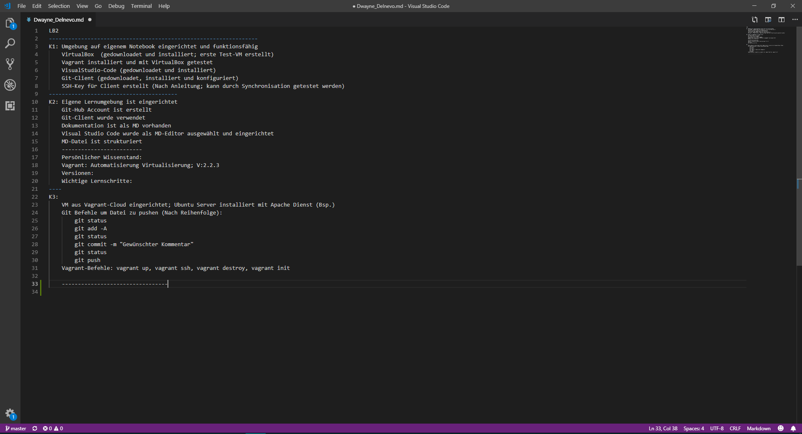

***
***
LB2
# Dokumentation LB2
**Zum Moduul 300 von Dwayne Delnevo**
***
## Inhaltsverzeichnis
- [Dokumentation LB2](#dokumentation-lb2)
  - [Inhaltsverzeichnis](#inhaltsverzeichnis)
  - [Persönlicher Wissensstand](#pers%C3%B6nlicher-wissensstand)
  - [test](#test)
  
  - [Wissenzuwachs](#wissenzuwachs)
  - [Reflexion](#reflexion)
  - [Quellen](#quellen)
  
-----------------------------------------------------------------
K1: Umgebung auf eigenem Notebook eingerichtet und funktionsfähig

* Virtualbox

* Vagrant

* Sublime

* Git-Client

    VirtualBox  (gedownloadet und installiert; erste Test-VM erstellt)
    Vagrant installiert und mit VirtualBox getestet 
    VisualStudio-Code (gedownloadet und installiert)
    Git-Client (gedownloadet, installiert und konfiguriert)
    SSH-Key für Client erstellt (Nach Anleitung; kann durch Synchronisation getestet werden)
----------------------------------------
K2: Eigene Lernumgebung ist eingerichtet

    Git-Hub Account ist erstellt 
    Git-Client wurde verwendet
    Dokumentation ist als MD vorhanden
    Visual Studio Code wurde als MD-Editor ausgewählt und eingerichtet
    MD-Datei ist strukturiert
    -------------------------
    Persönlicher Wissenstand:
    Vagrant: Automatisierung Virtualisierung; V:2.2.3
    Versionen:
    Wichtige Lernschritte:
----
K3:

    VM aus Vagrant-Cloud eingerichtet; Ubuntu Server installiert mit Apache Dienst (Bsp.)
    Git Befehle um Datei zu pushen (Nach Reihenfolge):
        git status
        git add -A
        git status
        git commit -m "Gewünschter Kommentar"
        git status
        git push
    Vagrant-Befehle: vagrant up, vagrant ssh, vagrant destroy, vagrant init
