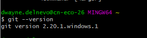

***
# Dokumentation LB2
**Zum Modul 300 von Dwayne Delnevo**
***
## Inhaltsverzeichnis
- [Dokumentation LB2](#dokumentation-lb2)
  - [Inhaltsverzeichnis](#inhaltsverzeichnis)
  - [Persönlicher Wissensstand](#pers%C3%B6nlicher-wissensstand)
  - [test](#test)
  
  - [Wissenzuwachs](#wissenzuwachs)
  - [Reflexion](#reflexion)
  - [Quellen](#quellen)
  

***
## Persönlicher Wissensstand
**Virtualisierung**  
Eigentlich ausschliesslich VMware Produkte verwendet; in der Schule oder gewissen üKs Workstation, im Geschäft meist ESXi. Ich habe auch schon viele interne (im Geschäft) Lehrlingsprojekte mit Virtualisierung gemacht. Im Privaten verwende ich eigentlich keine Virtualisierung.  
*Fazit:* Gute Kenntnisse  
**Vagrant**  
Ich habe Vagrant im Modul 300 kennengelernt.  
Fazit: Sehr neu für mich.  
**Git**  
Github habe ich auch im Modul 300 kennengelernt.  
Fazit: Auch sehr neu für mich.  
**Linux**  
In der TBZ wurde Linux zwischnendurch mal verwendet. Meist kam es jedoch in üKs zu Gebrauch.  
Fazit: Nicht neu, aber auch nicht die grössten Kenntnisse.  
**Systemsicherheit**  
Ich hatte bereits ein üK welcher sich explizit mit dem beschäftigte. Des Weiteren darf ich Geschäft oft auch Firewall mit konfigurieren oder für Testingzwecke selber testen.  
Fazit: Gute Kenntnisse.  
**Markdown**  
Ich habe Markdown im Modul 300 kennengelernt, vorhin kannte ich es nicht.  
Fazit: Sehr neu für mich.  

***
## K1: Umgebung auf eigenem Notebook eingerichtet und funktionsfähig  
* Virtualbox  

* Vagrant  
  

* VisualStudio  

* Git-Client  
  

**Git**  
Nach Anleitung des M300-Repositories gemacht:  
*Github*  
  1. Auf www.github.com Benutzerkonto erstellt
  2. Bestätigungsemail bestätigt und Anmeldung getestet.  

*Repository erstellen*  
  1. "New Repository" ausgewählt
  2. Name vergeben: M300-Services
  3. Public gemacht
  4. "Initialize this repository with a README" ausgewählt
  5. "Create a repository" wählen um Erstellung fertig zu stellen.  
  
*Git Hub*  
  1. Git 2.20.1 installiert (Mit Admin-Rechten)
  2. Standardinstallation
  3. Geöffnet und konfiguriert:  
    >$ git config --global user.name "<dwayne0001>"  
    >$ git config --global user.email "<dwayne.delnevo@hotmail.ch>"  

*SSH-Key*  
  1. Im Git Bash Termin:
    >ssh-keygen -t rsa -b 4096 -C "dwayne.delnevo@hotmail.ch"  
    >Enter a file in which to save the key (~/.ssh/id_rsa):  
    (Einfach Enter drücken)  
    >Enter passphrase (empty for no passphrase):  
    (Kennwort definieren)  
    >Enter same passphrase again:  
    (Kennwort erneut eingeben)  
   2. %HOME%/.ssh/id_rsa.pub mit Notepad öffnen und Schlüssel kopieren  
   3. Github Website öffnen und dort unter Settings/SSH den Schlüssel angebennd GPG keys angeben  
   
*Repository klonen*  
Modulrepository:  
    > git clone https://github.com/mc-b/M300  
    > cd M300  
    > git pull  
    > git status  
    
Mein Repository:  
    >git clone git@github.com:Dwayne0001/M300-Services.git  
    > git pull --> Um zu aktualisieren  
    > git status --> Um  Status der lokalen Kopie anzuzeigen  

**VirtualBox**  
Mit Hilfe von VirtualBox können Virtuelle Maschinen erstellt und verwaltet werden.  
VirtualBox ist eine Opensource-Virtualisierungssoftware.  
Da in diesem Modul keine speziellen Einstellungen notwendig sind, kann bei der Installation einfach die Standardinstallation verwendet werden.  

**Vagrant**  
Mit Hilfe von Vagrant kann man in VirtualBox automatisiert VMs und Services installieren lassen.  
Wie mit VirtualBox werden hier keine speziellen Einstellungen bei der Installation gebraucht, deshalb kann man die Standardinstallation verwenden.  

*Wichtige Befehle*  

Vagrantfile erstellen und Umgebung initialisieren  
> vagrant init  

Konfigurierung und Erstellung einer VM mit Vagrantfile  
> vagrant up  

Verbindung via SSH herstellen  
> vagrant ssh

Status der VM anzeigen  
> vagrant status

VM pausieren/stoppen  
> vagrant halt

VM zerstören  
> vagrant destroy

**VisualStudio Code**  
VisualStudio Code ist ein Texteditor von Microsoft.  
Mit VisualStudio kann man ein Repository direkt öffnen und wenn man fertig ist kann man es auch gleich wieder pushen (dafür werden aber Extensions benötigt).  
Bei der Installation von VisualStudio mussten wir für dieses Modul keine speziellen Angaben berücksichtigen; also Standardinstallation.  
*Benötigte Extensions:*  
  Markdown All in One  
  Vagrant Extension  
  vscode-pdf Extension  
  
Diese Extensions werden dazu benötigt damit diese Dokumentation und das Vagrant-file einfacher bearbeitet werden können.  
Diese Extensions werden wie folgt installiert:  
  1. VisualStudio Code öffnen  
  2. ExtensionMenu öffnen (Abkürzung: Ctrl+Shift+X)  
  3. Gewünschte Extension suchen und installieren  

----------------------------------------
K2: Eigene Lernumgebung ist eingerichtet

    Git-Hub Account ist erstellt 
    Git-Client wurde verwendet
    Dokumentation ist als MD vorhanden
    Visual Studio Code wurde als MD-Editor ausgewählt und eingerichtet
    MD-Datei ist strukturiert
    -------------------------
    Persönlicher Wissenstand:
    Vagrant: Automatisierung Virtualisierung; V:2.2.3
    Versionen:
    Wichtige Lernschritte:
----
K3:

    VM aus Vagrant-Cloud eingerichtet; Ubuntu Server installiert mit Apache Dienst (Bsp.)
    Git Befehle um Datei zu pushen (Nach Reihenfolge):
        git status
        git add -A
        git status
        git commit -m "Gewünschter Kommentar"
        git status
        git push
    Vagrant-Befehle: vagrant up, vagrant ssh, vagrant destroy, vagrant init
