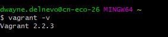

***
***
LB2
# Dokumentation LB2
**Zum Moduul 300 von Dwayne Delnevo**
***
## Inhaltsverzeichnis
- [Dokumentation LB2](#dokumentation-lb2)
  - [Inhaltsverzeichnis](#inhaltsverzeichnis)
  - [Persönlicher Wissensstand](#pers%C3%B6nlicher-wissensstand)
  - [test](#test)
  
  - [Wissenzuwachs](#wissenzuwachs)
  - [Reflexion](#reflexion)
  - [Quellen](#quellen)
  

***
## Persönlicher Wissensstand
**Virtualisierung**  
Eigentlich ausschliesslich VMware Produkte verwendet; in der Schule oder gewissen üKs Workstation, im Geschäft meist ESXi. Ich habe auch schon viele interne (im Geschäft) Lehrlingsprojekte mit Virtualisierung gemacht. Im Privaten verwende ich eigentlich keine Virtualisierung.  
*Fazit:* Gute Kenntnisse  
**Vagrant**  
Ich habe Vagrant im Modul 300 kennengelernt.  
Fazit: Sehr neu für mich.  
**Git**  
Github habe ich auch im Modul 300 kennengelernt.  
Fazit: Auch sehr neu für mich.  
**Linux**  
In der TBZ wurde Linux zwischnendurch mal verwendet. Meist kam es jedoch in üKs zu Gebrauch.  
Fazit: Nicht neu, aber auch nicht die grössten Kenntnisse.  
**Systemsicherheit**  
Ich hatte bereits ein üK welcher sich explizit mit dem beschäftigte. Des Weiteren darf ich Geschäft oft auch Firewall mit konfigurieren oder für Testingzwecke selber testen.  
Fazit: Gute Kenntnisse.  
**Markdown**  
Ich habe Markdown im Modul 300 kennengelernt, vorhin kannte ich es nicht.  
Fazit: Sehr neu für mich.  

***
## K1: Umgebung auf eigenem Notebook eingerichtet und funktionsfähig  
* Virtualbox

* Vagrant  
  

* Sublime

* Git-Client  
  

**Git**
Nach Anleitung des M300-Repositories gemacht:
*Github*
  1. Auf www.github.com Benutzerkonto erstellt
  2. Bestätigungsemail bestätigt und Anmeldung getestet.  

*Repository erstellen*
  1. "New Repository" ausgewählt
  2. Name vergeben: M300-Services
  3. Public gemacht
  4. "Initialize this repository with a README" ausgewählt
  5. "Create a repository"
  
----------------------------------------
K2: Eigene Lernumgebung ist eingerichtet

    Git-Hub Account ist erstellt 
    Git-Client wurde verwendet
    Dokumentation ist als MD vorhanden
    Visual Studio Code wurde als MD-Editor ausgewählt und eingerichtet
    MD-Datei ist strukturiert
    -------------------------
    Persönlicher Wissenstand:
    Vagrant: Automatisierung Virtualisierung; V:2.2.3
    Versionen:
    Wichtige Lernschritte:
----
K3:

    VM aus Vagrant-Cloud eingerichtet; Ubuntu Server installiert mit Apache Dienst (Bsp.)
    Git Befehle um Datei zu pushen (Nach Reihenfolge):
        git status
        git add -A
        git status
        git commit -m "Gewünschter Kommentar"
        git status
        git push
    Vagrant-Befehle: vagrant up, vagrant ssh, vagrant destroy, vagrant init
