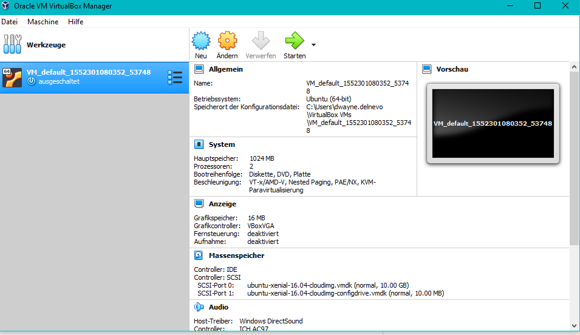
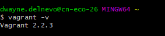
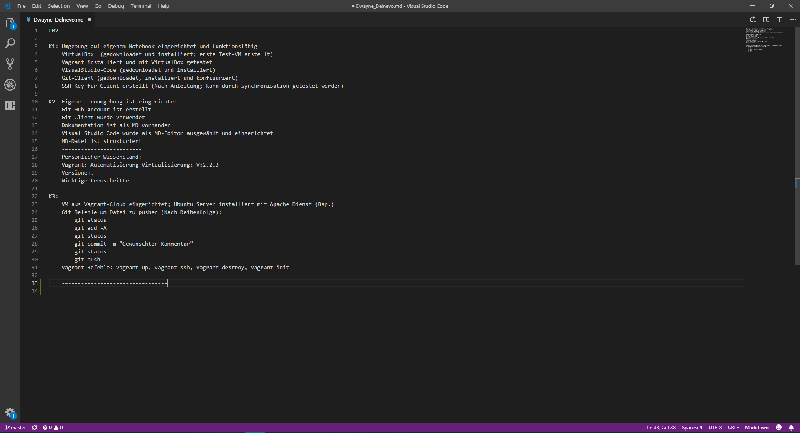
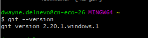
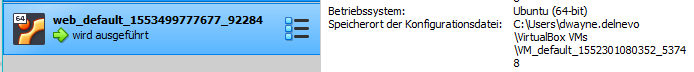

***
# Dokumentation LB1
**Zum Modul 300 von Dwayne Delnevo**
***
## Inhaltsverzeichnis
- [Dokumentation LB2](#dokumentation-lb2)
  - [Inhaltsverzeichnis](#inhaltsverzeichnis)
  - [Persönlicher Wissensstand](#pers%C3%B6nlicher-wissensstand)
  - [Umgebung auf eigenem Notebook eingerichtet und funktionsfähig](#umgebung-auf-eigenem-notebook-eingerichtet-und-funktionsfähig)
  - [Vorgefertigte VM mit Vagrant aufsetzen](#vorgefertigte-vm-mit-vagrant-aufsetzen)
  - [Vagrant Ubuntu VM mit Firewall und Webserver](#vagrant-ubuntu-vm-mit-firewall-und-webserver)
  - [Wissenswachstum](#wissenswachstum)
  - [Reflexion](#reflexion)
  - [Quellen](#quellen)
  

***
## Persönlicher Wissensstand
**Virtualisierung**  
Eigentlich ausschliesslich VMware Produkte verwendet; in der Schule oder gewissen üKs Workstation, im Geschäft meist ESXi. Ich habe auch schon viele interne (im Geschäft) Lehrlingsprojekte mit Virtualisierung gemacht. Im Privaten verwende ich eigentlich keine Virtualisierung.  
*Fazit:* Gute Kenntnisse  
**Vagrant**  
Ich habe Vagrant im Modul 300 kennengelernt.  
*Fazit:* Sehr neu für mich.  
**Git**  
Github habe ich auch im Modul 300 kennengelernt.  
*Fazit:* Auch sehr neu für mich.  
**Linux**  
In der TBZ wurde Linux zwischnendurch mal verwendet. Meist kam es jedoch in üKs zu Gebrauch.  
*Fazit:* Nicht neu, aber auch nicht die grössten Kenntnisse.  
**Systemsicherheit**  
Ich hatte bereits ein üK welcher sich explizit mit dem beschäftigte. Des Weiteren darf ich Geschäft oft auch Firewall mit konfigurieren oder für Testingzwecke selber testen.  
*Fazit:* Gute Kenntnisse.  
**Markdown**  
Ich habe Markdown im Modul 300 kennengelernt, vorhin kannte ich es nicht.  
*Fazit:* Sehr neu für mich.  

***
## Umgebung auf eigenem Notebook eingerichtet und funktionsfähig  
* Virtualbox  

* Vagrant  
  

* VisualStudio  

* Git-Client  
  

**Git**  
Nach Anleitung des M300-Repositories gemacht:  
*Github*  
  1. Auf www.github.com Benutzerkonto erstellt
  2. Bestätigungsemail bestätigt und Anmeldung getestet.  

*Repository erstellen*  
  1. "New Repository" ausgewählt
  2. Name vergeben: M300-Services
  3. Public gemacht
  4. "Initialize this repository with a README" ausgewählt
  5. "Create a repository" wählen um Erstellung fertig zu stellen.  
  
*Git Hub*  
  1. Git 2.20.1 installiert (Mit Admin-Rechten)
  2. Standardinstallation
  3. Geöffnet und konfiguriert:  
    >$ git config --global user.name "<dwayne0001>"  
    >$ git config --global user.email "<dwayne.delnevo@hotmail.ch>"  

*SSH-Key*  
  1. Im Git Bash Termin:
    >ssh-keygen -t rsa -b 4096 -C "dwayne.delnevo@hotmail.ch"  
    >Enter a file in which to save the key (~/.ssh/id_rsa):  
    (Einfach Enter drücken)  
    >Enter passphrase (empty for no passphrase):  
    (Kennwort definieren)  
    >Enter same passphrase again:  
    (Kennwort erneut eingeben)  
   2. %HOME%/.ssh/id_rsa.pub mit Notepad öffnen und Schlüssel kopieren  
   3. Github Website öffnen und dort unter Settings/SSH den Schlüssel angebennd GPG keys angeben  
   
*Repository klonen*  
Modulrepository:  
    > git clone https://github.com/mc-b/M300  
    > cd M300  
    > git pull  
    > git status  
    
Mein Repository:  
    >git clone git@github.com:Dwayne0001/M300-Services.git  
    > git pull --> Um zu aktualisieren  
    > git status --> Um  Status der lokalen Kopie anzuzeigen  

**VirtualBox**  
Mit Hilfe von VirtualBox können Virtuelle Maschinen erstellt und verwaltet werden.  
VirtualBox ist eine Opensource-Virtualisierungssoftware.  
Da in diesem Modul keine speziellen Einstellungen notwendig sind, kann bei der Installation einfach die Standardinstallation verwendet werden.  

**Vagrant**  
Mit Hilfe von Vagrant kann man in VirtualBox automatisiert VMs und Services installieren lassen.  
Wie mit VirtualBox werden hier keine speziellen Einstellungen bei der Installation gebraucht, deshalb kann man die Standardinstallation verwenden.  

*Wichtige Befehle*  

Vagrantfile erstellen und Umgebung initialisieren  
> vagrant init  

Konfigurierung und Erstellung einer VM mit Vagrantfile  
> vagrant up  

Verbindung via SSH herstellen  
> vagrant ssh

Status der VM anzeigen  
> vagrant status

VM pausieren/stoppen  
> vagrant halt

VM zerstören  
> vagrant destroy

**VisualStudio Code**  
VisualStudio Code ist ein Texteditor von Microsoft.  
Mit VisualStudio kann man ein Repository direkt öffnen und wenn man fertig ist kann man es auch gleich wieder pushen (dafür werden aber Extensions benötigt).  
Bei der Installation von VisualStudio mussten wir für dieses Modul keine speziellen Angaben berücksichtigen; also Standardinstallation.  
**Benötigte Extensions:**  
  - Markdown All in One  
  - Vagrant Extension  
  - vscode-pdf Extension  
  
Diese Extensions werden dazu benötigt damit diese Dokumentation und das Vagrant-file einfacher bearbeitet werden können.  
Diese Extensions werden wie folgt installiert:  
  1. VisualStudio Code öffnen  
  2. ExtensionMenu öffnen (Abkürzung: Ctrl+Shift+X)  
  3. Gewünschte Extension suchen und installieren  
  
***
##  Vorgefertigte VM mit Vagrant aufsetzen

Im M300 Repository ist ein Ubuntu VM mit Apache2 vorgefertigt. Damit ich diese bei mir aufsetzen kann, muss ich in das richtige Verzeichnis, also /M300/vagrant/web und nacher muss man den Befehl "vagrant up" anwenden. Sobald die VM aufgesetzt ist kann man mit "vagrant ssh" auf die VM zugreifen.  
  

***
## Vagrant Ubuntu VM mit Firewall und Webserver  

**Konfiguration**  
In der Kopie von meinem Repository, habe ich mit vagrant init ein Vagrantfile erstellt.  
Ich habe xenial64 verwendet.  
Um die Firewall und den Webserver zu installieren wurde folgend angepasst.  
  >Vagrant.configure("2") do |config|  
  >config.vm.box = "ubuntu/xenial64"  

Ich habe ein privates Netz ertellt (d.h. Host only). Es wurde die IP 192.168.100.10 verwendet.  
>config.vm.network "private_network", ip: "192.168.100.10"  

Es wird aus dem aktuellen Ordner ein shared Folder gemacht, der unter /var/www/html eingebunden wird.  
Da dies der Ordner ist, in dem der Webserver das html Dokument verwendet, kann ich im Voraus ein index file in den Ordner einfügen, welches vom Webserver verwendet wird.  
  >config.vm.synced_folder ".", "/var/www/html"  

Die VM wird mit VirtualBox geöffnet.  
  >config.vm.provider "virtualbox" do |vb|  

Es werden 4 GB Ram zur Verfügung gestellt-  
  >vb.memory = "4024"  
  >end  

Installieren von Apache2 und ufw. ufw erlaubt Ports von ssh und http und IPs vom 24-Netz 192.168.100.0  
 > config.vm.provision "shell", inline: <<-SHELL  
 > apt-get update  
 > apt-get install -y apache2  
 >apt-get update  
 >apt-get install -y ufw  
 >ufw allow ssh  
 >ufw allow http  
 >ufw allow from 192.168.100.0/24  

Da ein Neustart unerwünscht ist, wird die Firewall manuell eingeschaltet. yes Y | führt dazu, dass die Abrage beim enablen mit Y beantwrtet wird.  
  > yes Y | ufw enable  
  > SHELL  
  > end  

**Sicherheit**  
Der Zugriff über SSH ist standardmässig möglich.  
Beim automatisierten Aufsetzen, wird ein neuer SSH-Key generiert.  
Die Firewall erlaubt den Zugriff über SSH und HTTP. Zusätzlich habe ich festegelegt, dass nur IPs aus dem Netz 192.168.100.0 zugreifen dürfen.  

**Starten**  
Die VM kann mit vagrant up gestartet werden, wenn man die Konsole im Ordner mit dem Vagrantfile ausführt.  
Danach wird durch vagrant ssh eine Verbindung hergestellt.  

**Testen**  
*Aufsetzen*  
Im Ordner Vagrant folgenden Befehl ausführen und die VM wird verbunden.  
>vagrant up  
>vagrant ssh  

***
## Wissenswachstum  

**Linux**  
Die Befehle um Dienste/Software zu installieren kannte ich bereits.  
Ich habe aber gelernt mich besser in der Konsole zurecht zu finden.  

**Virtualisierung**  
Die verwendete Virtualisierungssoftware und die dazu entsprechenden Konfigurationen kannte ich bereits.  

**Systemsicherheit**
Ich konnte eine sichere Verbindung zu den VMs herstellen (SSH).  

**Markdown**  
Ich habe gelernt eine Dokumentation mit Markdown zu erstellen.  

**Vagrant**  
Ich habe gelernt eine Vagrantumgebung zu erstellen und das entsprechende Vagrantfile zu konfigurieren; aus diesem File ich dann automatisch VMs aufsetzten konnte.  

**Git**  
Ich habe gelernt was, Git, Repositories und Markdown sind. Wie man Repositories bearbeitet, klont und auch lokal absichert, und auch die Sprache Markdown und wie sie funktioniert.  
Fazit: Ich kannte Git und Repositories vorher garnicht und kenne mich jetzt ziemlich gut aus. Desweiteren habe ich eine neue Sprache kennengelernt.  

***  
## Reflexion  

Am Anfang hatte ich Schwierigkeiten wie Vagrant mit VirtualBox überhaupt funktioniert. Damit ich dieses Projekt überhaupt machen konnte, musste ich zuerst verstehen wie diese zwei Programme überhaupt zusammen funktionieren. Des Weiteren habe ich Markdown zu Beginn nicht richtig verstanden, dies kostete mich auch recht viel Zeit; es zu verstehen.  
Leider blieb so nicht all zu viel Zeit übrig für das Konfigurieren.  
Bei der nächsten LB werde ich diese Probleme nicht mehr haben (da ich jetzt beide Sachen besser verstehe) und somit kann ich mehr Zeit mit dem Konfigurieren auseinandersetzten.  

## Quellen  

* <https://github.com/mc-b/M300>  
* <https://bscw.tbz.ch/bscw/bscw.cgi/20887767>

***
